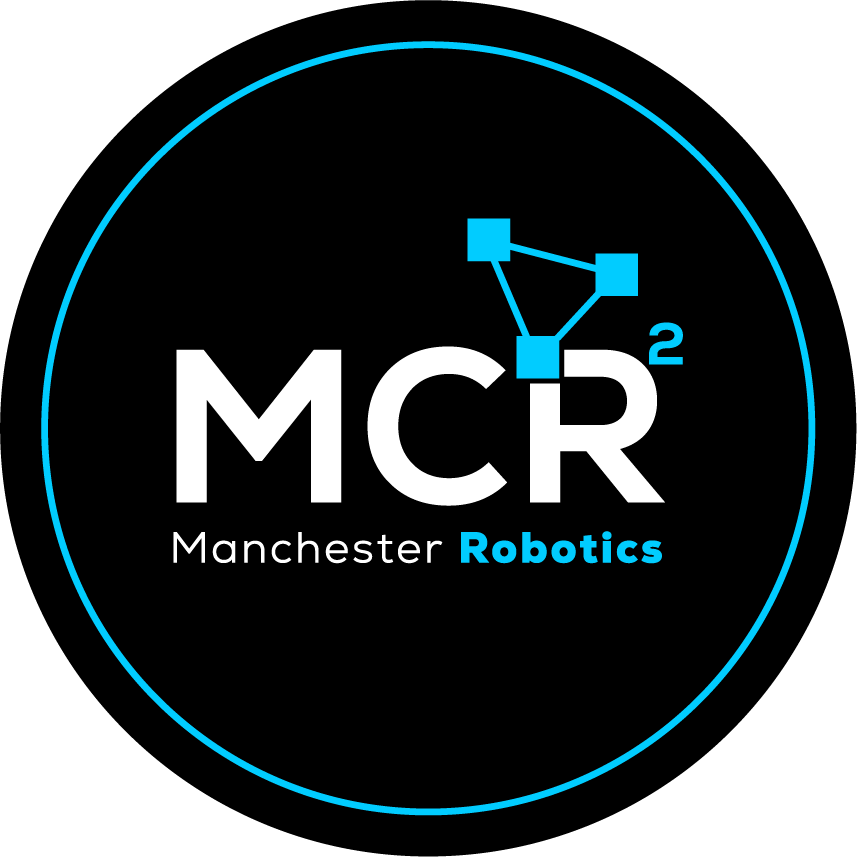

# 🤖 TE3003B: Integration of Robotics and Intelligent Systems (2026)
### 🚀 Final Project & Challenges Repository


<div align="center">
  
  <br>
  <i>Developed for the 8th Semester - Robotics Engineering</i>
</div>

---

## 📖 Overview
This repository contains our team's implementation of the **TE3003B** block in collaboration with **Manchester Robotics Ltd (MCR2)**. We focus on modern autonomous systems, localization techniques, navigation, and intelligent path planning using the **Puzzlebot Jetson/Lidar Edition**.

## 🛠️ Tech Stack & Requirements
| Component | Specification |
| :--- | :--- |
| **OS** | Ubuntu 22.04 LTS (Jammy Jellyfish) |
| **ROS2** | Humble Hawksbill |
| **Hardware** | Puzzlebot Jetson/Lidar Edition |
| **Python** | 3.10+ |
| **Simulator** | Gazebo |

---

## 📂 Project Structure
- **[`/challenges`](./challenges)**: 🧩 Weekly mini-challenges (Modelling, Kinematics, Probabilities, etc.)
- **[`/reto`](./reto)**: 🏆 **The Final Challenge**: Autonomous navigation with Kalman Filter and Aruco markers.
- **[`/professor_repo`](./professor_repo)**: 📚 Mirror of the [official repository](https://github.com/ManchesterRoboticsLtd/TE3003B_Integration_of_Robotics_and_Intelligent_Systems_2026) for quick reference to presentations and base code.

---

## 🗓️ Roadmap & Progress
- [x] **[Week 1: Dynamical Systems](./challenges/week1)** (URDF, Drone/Puzzlebot Modelling) ✅
- [ ] **Week 2: Mobile Robots Fundamentals** (Kinematics, Dead Reckoning)
- [ ] **Week 3: Probabilities** (Discrete/Continuous variables)
- [ ] **Week 4: Uncertainty** (Confidence Ellipsoids)
- [ ] **Week 5: Reactive Navigation** (Obstacle Avoidance: Bug 0, 1, 2)
- [ ] **Week 6: Sources of Information** (Bayes/Kalman Filter)
- [ ] **Week 7-9: Final Challenge** (Integrated Navigation & Grading)

---

## ⚙️ Automated CI/CD
We use **GitHub Actions** to ensure code reliability across the team:
- **`ROS2 Humble CI`**: Automatically builds and tests the workspace in a `ros:humble` container.
- **`Python Linting`**: Ensures all scripts follow PEP8 standards using `ruff` and `black`.

## 🛠️ Quick Setup
To build the workspace locally:
```bash
# Update and install dependencies
sudo apt update && sudo apt install -y python3-colcon-common-extensions

# Build
colcon build --symlink-install

# Source
source install/setup.bash
```

## 🤝 Team
*   **User**: [@Alfonso](https://github.com/alfonso) - *Robotics Lead*

---
> [!IMPORTANT]
> This project is for educational purposes. All proprietary designs belong to Manchester Robotics Ltd. (MCR2).
