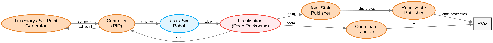

# Documentación Técnica: Reto Semana 3 - Challenge 3: Navegación Autónoma
**Alumno:** Alfonso  
**Asignatura:** Integración de Robótica y Sistemas Inteligentes  
**Framework:** ROS 2 Humble  

---

## 🏗️ 1. Arquitectura del Sistema
El proyecto se ha dividido modularmente en 3 partes, siguiendo fielmente el diagrama de bloques de Manchester Robotics. Cada bloque es un nodo independiente que se comunica mediante tópicos estándar de ROS 2.



Este diseño permite que el sistema sea escalable y fácil de depurar, separando la física del robot, la estimación de estado y la lógica de navegación.

---

## 🛠️ 2. Desglose por Partes

### Parte 1: Simulación Cinemática (`real_sim_robot`)
Es el "corazón físico" virtual. Recibe comandos de velocidad y calcula el movimiento teórico del robot.
*   **Nodo:** `/real_sim_robot`
*   **Entradas:** `/cmd_vel` (`geometry_msgs/Twist`)
*   **Salidas:** `/wr`, `/wl` (`std_msgs/Float32`) - Velocidades angulares de las ruedas.
*   **Lógica:** Implementa el modelo diferencial directo para convertir velocidades de chasis a velocidades de motor.
*   **Archivo:** `part1/kinematic_sim.py`

### Parte 2: Localización y Transformadas (`localisation` & `coordinate_transform`)
Encargada de estimar la posición del robot basándose en el movimiento de sus ruedas (Dead Reckoning) y publicarlo al árbol de transformadas.
*   **Nodos:** 
    *   `/localisation`: Recibe el feedback de los motores y calcula la pose (x, y, theta) usando integración numérica de Euler.
    *   `/coordinate_transform`: Toma la odometría y emite la señal `/tf` (`odom` ➔ `base_footprint`) para que RViz sepa dónde está el robot en el espacio.
    *   `/joint_state_publisher`: Convierte la odometría en rotación de las juntas para animar las ruedas en el modelo 3D.
*   **Entradas:** `/wr`, `/wl`
*   **Salidas:** `/odom`, `/tf`, `/joint_states`
*   **Archivo:** `part2/localisation.py`, `part2/coordinate_transform.py`

### Parte 3: Navegación Autónoma (`controller` & `trajectory_set_point_generator`)
La inteligencia que permite al robot seguir figuras geométricas de forma autónoma.
*   **Nodos:**
    *   `/controller`: Un controlador **PID** (Proporcional-Integral-Derivativo) para la orientación. Prioriza la alineación angular antes de avanzar linealmente, asegurando esquinas precisas y trayectorias limpias.
    *   `/trajectory_set_point_generator`: El "set point generator" que gestiona la secuencia de coordenadas para formar figuras (Cuadrado, Triángulo o Hexágono).
*   **Tópicos Clave:**
    *   `/set_point`: La coordenada `(x, y)` hacia donde el robot debe dirigirse.
    *   `/next_point`: Bandera `Bool` que el controlador activa al llegar a una meta, solicitando la siguiente coordenada.
*   **Archivo:** `part3/control.py`, `part3/trajectory_generator.py`

---

---

## 🔌 3. Análisis de Integración y Flujo de Señales (Control Loop)

La arquitectura implementada sigue un esquema de **Control de Lazo Cerrado (Closed-Loop Control)** distribuido en múltiples nodos asíncronos. Esta integración garantiza que la navegación sea robusta y fiel al modelo matemático del Puzzlebot.

### 🔄 Flujo Sistémico de Información
El diagrama de arquitectura (Sección 1) se materializa a través del siguiente intercambio de mensajes coordinado por `puzzlebot_challenge3_launch.py`:

1.  **Generación de Referencia (State Machine)**:
    *   **Archivo**: `part3/trajectory_generator.py`
    *   **Lógica**: Actúa como el *Master* de la misión. Publica una coordenada deseada en el tópico `/set_point`. Utiliza un sistema de estados para esperar la retroalimentación del controlador antes de iterar al siguiente waypoint de la lista (Cuadrado, Triángulo o Hexágono).

2.  **Lazo de Control Cinematográfico (Intelligence)**:
    *   **Archivo**: `part3/control.py`
    *   **Lógica**: Es el núcleo de procesamiento. Se suscribe simultáneamente a `/set_point` (referencia) y `/odom` (estado actual). Implementa un algoritmo **PID** para la orientación y una ley de control proporcional para la distancia. Envía el comando de actuación `/cmd_vel` al simulador.
    *   **Sincronización**: Al detectar que el error de posición es menor a la tolerancia (`dist_tolerance`), dispara un pulso `True` en el tópico `/next_point` para solicitar la siguiente meta al generador.

3.  **Actuación y Simulación Física (Plant)**:
    *   **Archivo**: `part1/kinematic_sim.py`
    *   **Lógica**: Representa la planta del sistema. Traduce los comandos de velocidad del chasis en velocidades angulares de ruedas motrices (`/wr`, `/wl`) mediante el modelo diferencial inverso, simulando el comportamiento real de los motores DC.

4.  **Estimación de Estado (Odometry)**:
    *   **Archivo**: `part2/localisation.py`
    *   **Lógica**: Realiza la integración numérica de las velocidades recibidas para reconstruir la pose del robot en el espacio (`/odom`). Este nodo cierra el lazo enviando la posición estimada de regreso al controlador.

5.  **Broadcast de Transformadas (TF Bridge)**:
    *   **Archivo**: `part2/coordinate_transform.py`
    *   **Lógica**: Desacopla la lógica de odometría de la visualización. Escucha `/odom` y emite el broadcast de la transformada `odom -> base_footprint`, permitiendo que el sistema de visualización (RViz) sincronice el modelo 3D con la realidad calculada.

---

## 🚀 4. Sistema de Lanzamiento (Launch Architecture)

El despliegue de este reto se orquesta mediante un **Launch File** avanzado que permite la configuración dinámica del sistema.

### Archivo Maestro: `puzzlebot_challenge3_launch.py`
Este archivo no solo arranca los nodos, sino que:
1.  **Carga el URDF**: Lee la descripción física del robot y la inyecta al `robot_state_publisher`.
2.  **Configura RViz**: Lanza la interfaz con una configuración preestablecida que ya incluye odometría y marcadores.
3.  **Gestiona Parámetros**: Permite pasar el argumento `shape` desde la consola para cambiar la trayectoria sin tocar el código.

### Registro de Nodos (Entry Points)
Para que ROS 2 reconozca nuestros scripts de Python como ejecutables, se configuró el archivo `setup.py` con los siguientes **Entry Points**:
| Nodo en Diagrama | Ejecutable en Paquete | Script de Origen |
| :--- | :--- | :--- |
| `/real_sim_robot` | `part1_kinematic_sim` | `part1/kinematic_sim.py` |
| `/localisation` | `part2_localisation` | `part2/localisation.py` |
| `/coordinate_transform` | `part2_coordinate_transform` | `part2/coordinate_transform.py` |
| `/controller` | `part3_control` | `part3/control.py` |
| `/trajectory_set_point_generator` | `part3_trajectory_generator` | `part3/trajectory_generator.py` |

---

## 🎮 4. Guía de Ejecución

Para correr todo el sistema integrado, sigue estos pasos en tu terminal:

### Paso 1: Build y Source
Se debe compilar el paquete para registrar los nuevos nodos y parámetros:
```bash
cd ~/manchester_bloque_link/challenges/week3
colcon build --packages-select puzzlebot_sim
source install/setup.bash
```

### Paso 2: Lanzar con Trayectoria Específica
Puedes lanzar el sistema completo y elegir la forma geométrica mediante el parámetro `shape`:

*   **Cuadrado (Default):**
    `ros2 launch puzzlebot_sim puzzlebot_challenge3_launch.py`
*   **Triángulo:**
    `ros2 launch puzzlebot_sim puzzlebot_challenge3_launch.py shape:=triangle`
*   **Hexágono:**
    `ros2 launch puzzlebot_sim puzzlebot_challenge3_launch.py shape:=hexagon`

---

## 📊 4. Herramientas de Diagnóstico y Validación

### Validación de la Red (`rqt_graph`)
Para verificar que el flujo de información es idéntico al diagrama de Manchester, ejecuta:
```bash
ros2 run rqt_graph rqt_graph
```
*Busca la conexión circular entre `controller`, `real_sim_robot` y `localisation`, que representa el lazo cerrado de control.*

### Análisis de Posición (`rqt_plot`)
Para observar el comportamiento de las coordenadas X y Y y validar la precisión del PID:
```bash
ros2 run rqt_plot rqt_plot --force-discover /pose_sim/pose/position/x /pose_sim/pose/position/y
```

### Visualización 3D (RViz)
Al arrancar el launch, RViz mostrará:
- **Marcadores Amarillos/Verdes:** Los puntos de paso (waypoints) de la trayectoria.
- **Rastro Rojo (Odometry):** La trayectoria real que el robot ha seguido, permitiendo comparar la teoría vs la práctica.

---

## 🛠️ 5. Mejoras de Robustez (Presentación Técnica)

Para este reto se implementaron dos lógicas avanzadas que garantizan un comportamiento profesional:

1.  **Giro en Sitio (Zero-Radius Turn)**: El controlador PID prioriza la alineación angular. Si el error de orientación es mayor a 0.2 rad, la velocidad lineal se anula automáticamente. Esto permite que el robot rote sobre su propio eje y trace esquinas perfectas sin hacer curvas abiertas.
2.  **Lazo de Señalización Latch**: Se diseñó un mecanismo de "un solo pulso" para la señal `next_point`. El controlador solo avisa una vez que llegó a la meta y se bloquea hasta recibir la siguiente coordenada. Esto elimina el riesgo de que el sistema "salte" puntos o se confunda al estar parado sobre un sensor virtual.
3.  **Visualización Dinámica**: El generador de trayectorias ilumina en **Verde** el objetivo actual y en **Amarillo** los objetivos restantes, facilitando la auditoría visual del movimiento durante las pruebas.
