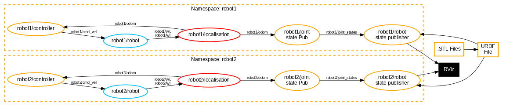

# Semana 4 — Mini Challenge 3: Simulación Multi-Robot con Puzzlebot

**Alumno:** Alfonso Díaz
**Asignatura:** Integración de Robótica y Sistemas Inteligentes (MCR²)
**Framework:** ROS 2 Humble

---

## Descripción del Reto

El **Mini Challenge 3** extiende el simulador cinemático del Puzzlebot para operar
**dos robots simultáneamente** dentro de un mismo entorno ROS 2. Según la especificación
del profesor, cada robot debe tener su propio stack de nodos completamente independiente,
con posición inicial diferente, trayectoria diferente, y sin compartir ningún tópico
ni frame de transformada con el otro robot.

Conceptos evaluados:

- **Namespaces de ROS 2** — aislamiento automático de tópicos por robot
- **tf_prefix** — aislamiento manual del árbol de transformadas (TF)
- **Parámetros** — configuración de pose inicial y trayectoria sin modificar código
- **Launch reutilizable** — `IncludeLaunchDescription` para escalar a N robots

---

## Diagrama de Nodos

El siguiente diagrama reproduce exactamente la arquitectura del PDF del Mini Challenge 3.
Cada robot tiene su propio lazo cerrado de control completamente aislado:



> Adicionalmente se incluyó el nodo `coordinate_transform` (puente odom → TF)
> y el `trajectory_generator` (secuenciador de waypoints) por encima de lo
> requerido en el diagrama base, completando el lazo de control autónomo.

---

## Árbol de Archivos del Paquete

```
challenges/week4/
├── MCR2_Mini_Challenge3.pdf          ← especificación del reto
├── README.md                         ← este archivo
└── puzzlebot_sim/
    ├── package.xml
    ├── setup.py
    ├── setup.cfg
    ├── launch/
    │   ├── multi_robot_launch.py     ← LANZADOR PRINCIPAL (2 robots + RViz)
    │   ├── robot_launch.py           ← plantilla reutilizable de 1 robot
    │   ├── puzzlebot_challenge2_launch.py
    │   ├── puzzlebot_challenge4_launch.py
    │   └── puzzlebot_launch.py
    ├── puzzlebot_sim/
    │   ├── part1/
    │   │   └── kinematic_sim.py      ← simulador cinemático (planta virtual)
    │   ├── part2/
    │   │   ├── localisation.py       ← odometría por dead reckoning
    │   │   ├── joint_state_publisher.py  ← animación de ruedas en RViz
    │   │   └── coordinate_transform.py  ← puente odom → TF dinámica
    │   └── part3/
    │       ├── control.py            ← controlador PID de posición
    │       └── trajectory_generator.py  ← secuenciador de waypoints
    ├── urdf/
    │   └── puzzlebot.urdf            ← modelo 3D del robot
    ├── meshes/
    │   ├── Puzzlebot_Jetson_Lidar_Edition_Base.stl
    │   ├── Puzzlebot_Wheel.stl
    │   └── Puzzlebot_Caster_Wheel.stl
    └── rviz/
        ├── multi_puzzlebot_rviz.rviz ← config RViz para 2 robots
        └── puzzlebot_rviz.rviz
```

---

## Guía de Orquestación y Flujo de Datos

Para lograr una simulación estable de múltiples robots, se implementó un flujo jerárquico que garantiza que el código sea 100% modular y reutilizable.

### 1. El Lanzador Maestro (`multi_robot_launch.py`)
Este es el punto de entrada principal. Su función es instanciar el "stack" completo de navegación para cada robot. 
* **Reutilización:** En lugar de copiar y pegar código, invoca dos veces al archivo `robot_launch.py`.
* **Diferenciación:** Pasa argumentos específicos (`robot_ns`, `x_init`, `shape`) para que cada instancia sepa quién es y desde dónde empieza.

### 2. Aislamiento Dinámico (`robot_launch.py`)
Dentro de este archivo ocurre la magia del aislamiento:
* **Namespaces:** Se usa `PushRosNamespace` para que todos los tópicos (como `cmd_vel`) se conviertan automáticamente en local-relative (ej. `/robot1/cmd_vel`).
* **URDF Dinámico:** El script lee el archivo `.urdf` base y, mediante la función `_make_prefixed_urdf`, inyecta en tiempo de ejecución los prefijos de los nombres de los eslabones y el color del chasis (Rojo para Robot 1, Azul para Robot 2). Esto permite que un solo archivo de descripción sirva para N robots.

### 3. El Ciclo de Control (Lazo Cerrado)
Cada robot ejecuta el siguiente flujo matemático paso a paso:

1. **Planificación:** El `trajectory_generator` calcula la lista de puntos objetivo sumando el desplazamiento inicial (`x_init`, `y_init`) para evitar colisiones.
2. **Control:** El `controller` recibe la posición actual de la odometría y el punto objetivo. Aplica las leyes de control PID para generar una velocidad lineal `v` y angular `w`.
3. **Simulación (La Física):** El nodo `kinematic_sim` recibe `(v, w)` y aplica la **Integración de Euler** para calcular la nueva pose teórica y la velocidad requerida en cada rueda (`wr`, `wl`).
4. **Percepción (Localización):** El nodo `localisation` actúa como un sensor virtual; toma las velocidades de las ruedas y reconstruye la trayectoria real del robot (Dead Reckoning).
5. **Visualización:** La odometría se envía al `joint_state_publisher` para animar las ruedas en RViz y al `coordinate_transform` para mover el modelo completo en el espacio 3D.

---

## Qué se implementó

### Parte 1 — Simulador Cinemático (`part1/kinematic_sim.py`)

Representa la **planta física virtual** del Puzzlebot. Integra los comandos de
velocidad `(v, ω)` para estimar la posición del robot en cada ciclo de 50 Hz y
calcula las velocidades angulares de cada rueda.

**Modelo diferencial (integración de Euler):**

```
x(t+dt)  = x(t)  + v·cos(θ)·dt
y(t+dt)  = y(t)  + v·sin(θ)·dt
θ(t+dt)  = θ(t)  + ω·dt

wr = (v + ω·L/2) / r      ← rueda derecha  [rad/s]
wl = (v − ω·L/2) / r      ← rueda izquierda [rad/s]
```

| I/O     | Tópico                      | Tipo                          |
| ------- | ---------------------------- | ----------------------------- |
| Entrada | `robotN/cmd_vel`           | `geometry_msgs/Twist`       |
| Salida  | `robotN/wr`, `robotN/wl` | `std_msgs/Float32`          |
| Salida  | `robotN/pose_sim`          | `geometry_msgs/PoseStamped` |

**Parámetro nuevo para multi-robot:** `x_init`, `y_init`, `theta_init` — inicializa el integrador en la posición de arranque de cada robot.

---

### Parte 2 — Localización (`part2/localisation.py`)

Estima la pose del robot a partir de las velocidades de rueda mediante **dead reckoning**. Publica la pose como odometría estándar de ROS 2.

**Modelo cinemático inverso:**

```
v = r · (wr + wl) / 2      ← velocidad lineal del centro
ω = r · (wr − wl) / L      ← velocidad angular
```

| I/O     | Tópico                      | Tipo                  |
| ------- | ---------------------------- | --------------------- |
| Entrada | `robotN/wr`, `robotN/wl` | `std_msgs/Float32`  |
| Salida  | `robotN/odom`              | `nav_msgs/Odometry` |

**Parámetro clave:** `tf_prefix` — construye los frame IDs prefixados (`robot1/odom`, `robot1/base_footprint`) para evitar colisiones en el árbol de TF.

---

### Parte 2 — Joint State Publisher (`part2/joint_state_publisher.py`)

Calcula el ángulo acumulado de cada rueda a partir de la odometría y lo publica para que `robot_state_publisher` anime el modelo 3D en RViz.

| I/O     | Tópico                 | Tipo                       |
| ------- | ----------------------- | -------------------------- |
| Entrada | `robotN/odom`         | `nav_msgs/Odometry`      |
| Salida  | `robotN/joint_states` | `sensor_msgs/JointState` |

---

### Parte 2 — Coordinate Transform (`part2/coordinate_transform.py`)

Publica la transformada **dinámica** TF: `robotN/odom → robotN/base_footprint`.

Este nodo es crítico en el escenario multi-robot: sin él, RViz no sabría dónde
colocar el modelo 3D de cada robot. Sin `tf_prefix`, ambos robots publicarían
`odom → base_footprint` y el árbol de TF se corrompería.

| I/O       | Tópico / TF                             | Tipo                  |
| --------- | ---------------------------------------- | --------------------- |
| Entrada   | `robotN/odom`                          | `nav_msgs/Odometry` |
| Salida TF | `robotN/odom → robotN/base_footprint` | `TransformStamped`  |

---

### Parte 3 — Controlador PID (`part3/control.py`)

Lazo de control cerrado que lleva al robot hacia un punto objetivo `(x, y)`.

**Estrategia "alinear primero, avanzar después":**

```
si |error_angular| > 0.2 rad  →  v = 0   (giro en sitio)
si no                          →  v = kv · distancia
```

**PID angular completo:**

```
ω = kp_w · e + ki_w · ∫e·dt + kd_w · de/dt
```

Saturaciones: `v ∈ [0, 0.3] m/s`  |  `ω ∈ [−1.5, 1.5] rad/s`

| I/O     | Tópico               | Tipo                    |
| ------- | --------------------- | ----------------------- |
| Entrada | `robotN/odom`       | `nav_msgs/Odometry`   |
| Entrada | `robotN/set_point`  | `geometry_msgs/Point` |
| Salida  | `robotN/cmd_vel`    | `geometry_msgs/Twist` |
| Salida  | `robotN/next_point` | `std_msgs/Bool`       |

---

### Parte 3 — Generador de Trayectorias (`part3/trajectory_generator.py`)

Secuencia los waypoints de la figura seleccionada y coordina con el controlador.

**Figuras disponibles:**

| `shape`    | Waypoints                                    |
| ------------ | -------------------------------------------- |
| `square`   | (1.5, 0) → (1.5, 1.5) → (0, 1.5) → (0, 0) |
| `triangle` | (1.5, 0) → (0.75, 1.3) → (0, 0)            |
| `hexagon`  | 6 vértices a radio 1.0 m                    |

Los waypoints se visualizan como esferas en RViz:

- **Verde** = objetivo actual
- **Amarillo semitransparente** = waypoints pendientes

---

## Separación de Namespaces y TF

El aislamiento entre robots opera en dos capas independientes:

### Capa 1 — Tópicos (namespace ROS 2)

`PushRosNamespace` dentro del `GroupAction` en `robot_launch.py` prefija automáticamente todos los tópicos relativos:

| Tópico relativo | `/robot1/...`          | `/robot2/...`          |
| ---------------- | ------------------------ | ------------------------ |
| `cmd_vel`      | `/robot1/cmd_vel`      | `/robot2/cmd_vel`      |
| `odom`         | `/robot1/odom`         | `/robot2/odom`         |
| `wr` / `wl`  | `/robot1/wr`           | `/robot2/wr`           |
| `set_point`    | `/robot1/set_point`    | `/robot2/set_point`    |
| `joint_states` | `/robot1/joint_states` | `/robot2/joint_states` |

### Capa 2 — Árbol de TF (`tf_prefix`)

Los frame IDs de TF son **strings globales** en ROS 2; no se aíslan por namespace.
El parámetro `tf_prefix` se pasa manualmente a `localisation`, `joint_state_publisher`,
`coordinate_transform` y al URDF prefixado:

| Frame      | `robot1`                | `robot2`                |
| ---------- | ------------------------- | ------------------------- |
| Odometría | `robot1/odom`           | `robot2/odom`           |
| Base       | `robot1/base_footprint` | `robot2/base_footprint` |
| Chasis     | `robot1/base_link`      | `robot2/base_link`      |
| Rueda D    | `robot1/wheel_r`        | `robot2/wheel_r`        |
| Rueda I    | `robot1/wheel_l`        | `robot2/wheel_l`        |

---

## Sistema de Lanzamiento (Modular)

Para este reto se implementó un sistema de lanzamiento **modular y escalable**. Aunque el paquete contiene dos archivos de launch principales, el usuario final **solo ejecuta uno**.

### `multi_robot_launch.py` — El Orquestador Único
Es el archivo maestro y el **único que debe ejecutarse** para iniciar la simulación completa. Su función es coordinar el entorno global:
1. Llama a `robot_launch.py` para el **Robot 1**.
2. Llama a `robot_launch.py` para el **Robot 2**.
3. Lanza la instancia única de **RViz** con la configuración compartida.

> **Ventaja:** Solo se requiere un comando en la terminal para levantar 16 nodos, 2 robots y la interfaz gráfica.

### `robot_launch.py` — La Plantilla (Template)
Este archivo no se ejecuta manualmente en el flujo principal. Funciona como una **función reutilizable** que define el stack estándar de navegación de un Puzzlebot:
* Acepta parámetros (`robot_ns`, `x_init`, etc.) para personalizar cada instancia.
* Garantiza que si se desea agregar un tercer o cuarto robot, no sea necesario escribir nuevo código, solo añadir una línea al Orquestador.

---

### Jerarquía de Ejecución:

```
multi_robot_launch.py (Ejecutado por el usuario)
├── IncludeLaunchDescription(robot_launch.py)  ← robot1, cuadrado, origen (0, 0)
├── IncludeLaunchDescription(robot_launch.py)  ← robot2, triángulo, (3, 0)
└── Node(rviz2, multi_puzzlebot_rviz.rviz)
```

### `robot_launch.py` — Plantilla Reutilizable

Levanta **8 nodos** para un robot, todos dentro del mismo namespace:

```
GroupAction(PushRosNamespace('robotN'))
├── robot_state_publisher   ← URDF prefixado + joint_states → TF estáticas de links
├── kinematic_sim           ← cmd_vel → wr/wl + pose_sim
├── localisation            ← wr/wl → odom
├── joint_state_publisher   ← odom → joint_states
├── coordinate_transform    ← odom → TF dinámica
├── trajectory_generator    ← waypoints → set_point + marcadores RViz
├── controller              ← odom + set_point → cmd_vel + next_point
└── static_transform_pub    ← TF estática: map → robotN/odom  (en origen)
```

### Entry Points (`setup.py`)

| Ejecutable                      | Nodo                         |
| ------------------------------- | ---------------------------- |
| `part1_kinematic_sim`         | `kinematic_sim.py`         |
| `part2_localisation`          | `localisation.py`          |
| `part2_joint_state_publisher` | `joint_state_publisher.py` |
| `part2_coordinate_transform`  | `coordinate_transform.py`  |
| `part3_control`               | `control.py`               |
| `part3_trajectory_generator`  | `trajectory_generator.py`  |

---

## Guía de Ejecución

### Paso 1 — Compilar el paquete

```bash
cd ~/Documents/8\ Semestre/manchester_bloque
colcon build --packages-select puzzlebot_sim --base-paths challenges/week4
source install/setup.bash
```

### Paso 2 — Lanzar ambos robots

```bash
ros2 launch puzzlebot_sim multi_robot_launch.py
```

- **Robot 1** arranca en `(0, 0)` y recorre un **cuadrado** de 1.5 m de lado (rojo).
- **Robot 2** arranca en `(3, 0)` y recorre un **triángulo** (azul).
- Se abre RViz con la configuración multi-robot preconfigurada.

### Paso 3 — (opcional) Lanzar un solo robot personalizado

```bash
ros2 launch puzzlebot_sim robot_launch.py \
  robot_ns:=robot1 \
  x_init:=0.0 y_init:=0.0 \
  shape:=hexagon
```

---

## Herramientas de Diagnóstico

### Verificar tópicos por robot

```bash
ros2 topic list | grep robot1
ros2 topic list | grep robot2
```

### Verificar el árbol de TF (sin colisiones entre robots)

```bash
ros2 run tf2_tools view_frames
# Abre el PDF generado: debe haber dos subárboles separados bajo robot1/ y robot2/
```

### Monitorear odometría en tiempo real

```bash
ros2 topic echo /robot1/odom --no-arr
ros2 topic echo /robot2/odom --no-arr
```

### Grafo completo de nodos y tópicos

```bash
ros2 run rqt_graph rqt_graph
```

Deben verse dos grupos de nodos completamente desconectados entre sí,
cada uno con su propio lazo cerrado de control.

### Plotear trayectoria de ambos robots

```bash
ros2 run rqt_plot rqt_plot \
  /robot1/odom/pose/pose/position/x \
  /robot1/odom/pose/pose/position/y \
  /robot2/odom/pose/pose/position/x \
  /robot2/odom/pose/pose/position/y
```

---

## Decisiones de Diseño

### ¿Por qué `tf_prefix` como parámetro y no usar el namespace automático?

ROS 2 namespaces aíslan tópicos automáticamente, pero **los frame IDs del árbol
de TF son strings globales** — no se modifican por namespace. Sin prefijo manual,
ambos robots publicarían `odom → base_footprint` y el árbol se corrompería.
El parámetro `tf_prefix` construye frames únicos: `robot1/odom`, `robot2/odom`, etc.

### ¿Por qué la TF estática `map → robotN/odom` tiene offset (0, 0, 0)?

El nodo `localisation` ya inicializa su integrador interno en `(x_init, y_init)`.
Si el offset también se pusiera aquí, RViz aplicaría la traslación DOS VECES
y el modelo visual se desplazaría del punto matemático del controlador.

### ¿Por qué `x_init`/`y_init` se pasan tanto a `kinematic_sim` como a `localisation`?

Ambos nodos mantienen su propio integrador de posición. Si solo se inicializa uno,
el otro partiría de `(0,0)` y el lazo de control vería una discrepancia inicial.
Inicializando ambos con el mismo valor se garantiza coherencia desde el primer ciclo.

### ¿Por qué un launch reutilizable en lugar de duplicar todo?

Duplicar el launch viola el principio DRY y dificulta el mantenimiento: un cambio
en un parámetro de PID requeriría editarlo en dos lugares. Con `IncludeLaunchDescription`
se puede escalar a N robots modificando únicamente el archivo maestro.

### Prevención de Colisiones (Offset de Trayectorias)

Las trayectorias geométricas (`square`, `triangle`, etc.) están programadas relativas al origen. Para evitar colisiones en un entorno multi-robot (ej. el `robot2` yendo hacia `(0,0)` y chocando con el `robot1`), el nodo `trajectory_generator` recibe `x_init` y `y_init`. Internamente, desplaza todos los waypoints sumando estas coordenadas iniciales, garantizando que el robot siempre trace su figura en su carril asignado.

### Resolución de "Ghost Links" y Errores Rojos en RViz

Durante el desarrollo multi-robot es común ver links en rojo en RViz con errores tipo *No transform from [base_link]*. Esto ocurre por un "doble prefijo". El script `robot_launch.py` inyecta de forma dinámica los prefijos directamente en el URDF en tiempo de ejecución. Si se configura manualmente el campo `TF Prefix` en el visualizador `RobotModel` de RViz, RViz intenta añadir un segundo prefijo a links que ya están aislados, colapsando el renderizado visual. La solución arquitectónica correcta (implementada) es dejar `TF Prefix=""` en RViz y permitir que el URDF dinámico gestione el aislamiento.
